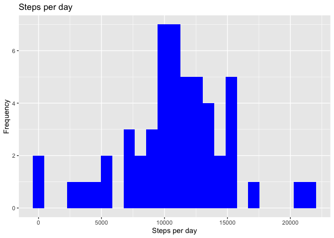

```r
library(knitr)
opts_chunk$set(echo = TRUE)
library(dplyr)
```

```
## 
## Attaching package: 'dplyr'
```

```
## The following objects are masked from 'package:stats':
## 
##     filter, lag
```

```
## The following objects are masked from 'package:base':
## 
##     intersect, setdiff, setequal, union
```

```r
library(ggplot2)
library(lubridate)
```

```
## 
## Attaching package: 'lubridate'
```

```
## The following object is masked from 'package:base':
## 
##     date
```

## Loading and preprocessing the data

```r
data <- read.csv("activity.csv", header = TRUE, sep = ',')
data$date <- ymd(data$date)
head(data)
```

```
##   steps       date interval
## 1    NA 2012-10-01        0
## 2    NA 2012-10-01        5
## 3    NA 2012-10-01       10
## 4    NA 2012-10-01       15
## 5    NA 2012-10-01       20
## 6    NA 2012-10-01       25
```

## What is the mean and median total number of steps taken per day?

### Calculating the steps

```r
steps_taken <- data %>%
  filter(!is.na(steps)) %>%
  group_by(date) %>%
  summarize(steps = sum(steps)) %>%
  print
```

```
## # A tibble: 53 x 2
##    date       steps
##    <date>     <int>
##  1 2012-10-02   126
##  2 2012-10-03 11352
##  3 2012-10-04 12116
##  4 2012-10-05 13294
##  5 2012-10-06 15420
##  6 2012-10-07 11015
##  7 2012-10-09 12811
##  8 2012-10-10  9900
##  9 2012-10-11 10304
## 10 2012-10-12 17382
## # … with 43 more rows
```

### Calculating the mean and median

```r
mean_steps <- mean(steps_taken$steps, na.rm = TRUE)
mean_steps
```

```
## [1] 10766.19
```

```r
median_steps <- median(steps_taken$steps, na.rm = TRUE)
median_steps
```

```
## [1] 10765
```

### Constructing the histogram

```r
ggplot(steps_taken, aes (x = steps)) +
  geom_histogram(fill = "blue", binwidth = 900) +
  labs(title = "Steps per day", x = "Steps per day", y = "Frequency")
```

<!-- -->

## What is the average daily activity pattern?

### Calculating the average steps

```r
interval_based <- data %>%
  filter(!is.na(steps)) %>%
  group_by(interval) %>%
  summarize(steps = mean(steps)) %>%
  print
```

```
## # A tibble: 288 x 2
##    interval  steps
##       <int>  <dbl>
##  1        0 1.72  
##  2        5 0.340 
##  3       10 0.132 
##  4       15 0.151 
##  5       20 0.0755
##  6       25 2.09  
##  7       30 0.528 
##  8       35 0.868 
##  9       40 0     
## 10       45 1.47  
## # … with 278 more rows
```

### Constructing the plot

```r
ggplot(interval_based, aes(x = interval, y = steps)) +
  geom_line(color = "black")
```

<!-- -->

### The maximum steps

```r
interval_based[which.max(interval_based$steps),]
```

```
## # A tibble: 1 x 2
##   interval steps
##      <int> <dbl>
## 1      835  206.
```

## Imputing missing values

### Filling the missing values

```r
all_data <- data
nas <- is.na(all_data$steps)
avg_interval <- tapply(all_data$steps, all_data$interval, mean, na.rm = TRUE, simplify = TRUE)
all_data$steps[nas] <- avg_interval[as.character(all_data$interval[nas])]
```

### Calculating the steps

```r
steps_all_data <- all_data %>%
  filter(!is.na(steps)) %>%
  group_by(date) %>%
  summarize(steps = sum(steps)) %>%
  print
```

```
## # A tibble: 61 x 2
##    date        steps
##    <date>      <dbl>
##  1 2012-10-01 10766.
##  2 2012-10-02   126 
##  3 2012-10-03 11352 
##  4 2012-10-04 12116 
##  5 2012-10-05 13294 
##  6 2012-10-06 15420 
##  7 2012-10-07 11015 
##  8 2012-10-08 10766.
##  9 2012-10-09 12811 
## 10 2012-10-10  9900 
## # … with 51 more rows
```

### Calculating the mean and median

```r
mean_steps_all_data <- mean(steps_all_data$steps, na.rm = TRUE)
mean_steps_all_data
```

```
## [1] 10766.19
```

```r
median_steps_all_data <- median(steps_all_data$steps, na.rm = TRUE)
median_steps_all_data
```

```
## [1] 10766.19
```

### Constructing the histogram

```r
ggplot(steps_all_data, aes (x = steps)) +
  geom_histogram(fill = "purple", binwidth = 900) +
  labs(title = "Steps per day iincluding missing values", x = "Steps per day", y = "Frequency")
```

<!-- -->

## Are there differences in activity patterns between weekdays and weekends?

### To determine whether a weekday or weekend

```r
all_data <- mutate(all_data, weektype = ifelse(weekdays(all_data$date) == "Saturday" | weekdays(all_data$date) == "Sunday", "weekend", "weekday"))
all_data$weektype <- as.factor(all_data$weektype)
head(all_data)
```

```
##       steps       date interval weektype
## 1 1.7169811 2012-10-01        0  weekday
## 2 0.3396226 2012-10-01        5  weekday
## 3 0.1320755 2012-10-01       10  weekday
## 4 0.1509434 2012-10-01       15  weekday
## 5 0.0754717 2012-10-01       20  weekday
## 6 2.0943396 2012-10-01       25  weekday
```

### Calculating the average steps

```r
interval_all_data <- all_data %>%
  group_by(interval, weektype) %>%
  summarize(steps = mean(steps))
```

### Displaying the plots

```r
p <- ggplot(interval_all_data, aes(x = interval, y = steps, color = weektype)) +
  geom_line() +
  facet_wrap(~weektype, ncol = 1, nrow = 2)
print(p)
```

<!-- -->
